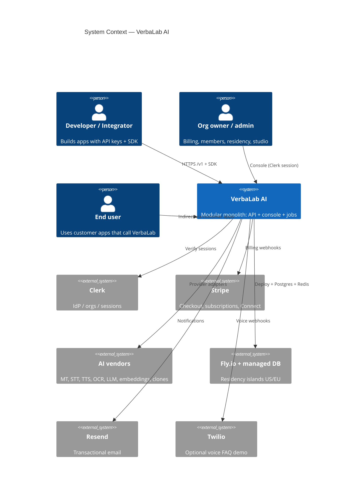
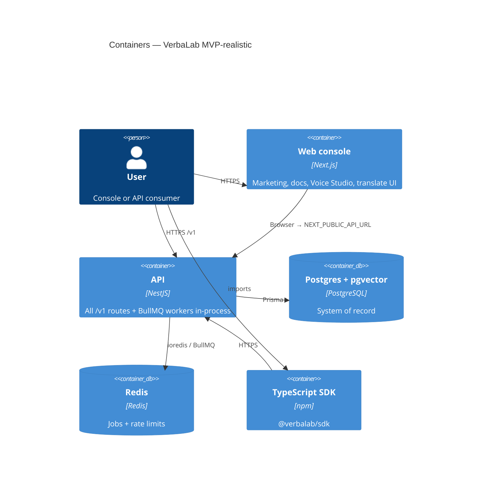
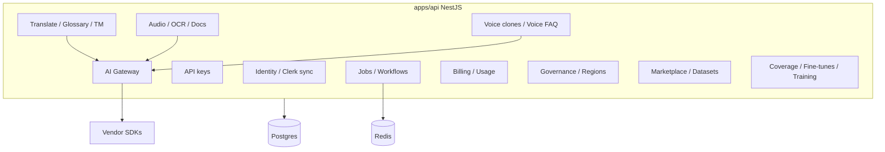
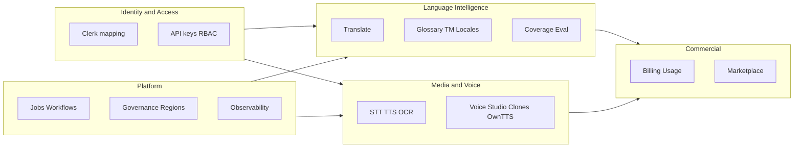
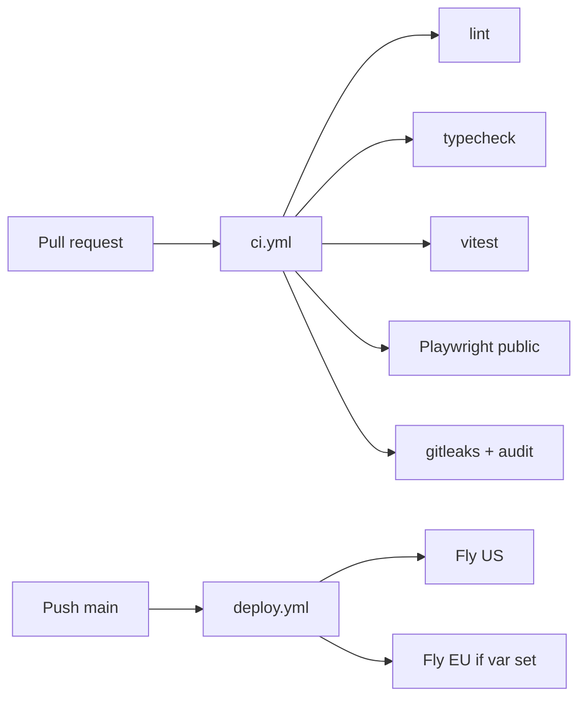

# VerbaLab AI — Enterprise Product Blueprint (Phase −1)

**Status:** Accepted as living documentation  
**Date:** 2026-09-07  
**Sources:** `ROADMAP.md`, `ARCHITECTURE.md`, libraries v1/v2 (compressed)  
**Rule:** Documentation only. No application code in this phase. Does **not** invent Kubernetes, AI Kernel, VAIOS, or six repos — those stay vision unless explicitly scheduled later.

**North star:** African language-intelligence **API company** with a developer console — orchestration, tenancy, eval, and UX — buying models first.

---

## 1. System Context

VerbaLab sits between **enterprise buyers / developers** and **vendor AI + identity + billing**. Customers never call Google/OpenAI/ElevenLabs/Stripe/Clerk directly for product workflows; they call VerbaLab’s `/v1` API or use the console.



### External actors

| Actor | Need |
| --- | --- |
| Developer | Stable REST `/v1`, OpenAPI, SDK, API keys, usage |
| Org owner | Plan, members, data residency, governance export/delete |
| Platform admin | Allowlisted org disable / key revoke |
| Vendors | Paid capacity; VerbaLab meters and enforces quotas |

---

## 2. C4 Diagrams

### 2.1 Container (Level 2)



### 2.2 Component view — `apps/api` (Level 3, modular monolith)

Bounded NestJS modules share one process and one database. **Not** one microservice per library “Cloud.”



### 2.3 Code shape (Level 4 — intentional non-CQRS)

- Controllers → Services → Prisma / Gateway adapters  
- No separate command/query buses per module  
- Domain events = `audit_events` + optional outbound webhooks (signed)

---

## 3. Business Context

### Mission

Make **African-language** speech, translation, and voice products **sellable and true** (coverage eval, glossaries, residency) — not a hyperscaler replica.

### Buyers

| Segment | Jobs to be done |
| --- | --- |
| African governments / public sector | Residency, glossary accuracy, audit |
| Banks / health | Vertical packs, consent, retention |
| Developers / startups | Fast API, SDK, free→Pro |
| Media / call centers | STT/TTS, interpreter, voice FAQ |

### Value chain

1. Acquire (docs, coverage page, marketplace)  
2. Activate (Clerk org → API key → first translate)  
3. Expand (media, Voice Studio, RAG, workflows)  
4. Monetize (Stripe free/Pro, Connect payouts)  
5. Differentiate (eval harness, vertical glossaries, own TTS path)

### Non-goals (business)

- Becoming a foundation-model lab without capital (VL-112 blocked)  
- Selling “AI Internet” / nation-platform narratives as shipped product

---

## 4. Product Context

### Product surfaces

| Surface | Path / artifact | Audience |
| --- | --- | --- |
| Console | `apps/web` | Operators |
| Public API | `/v1/*` | Developers |
| OpenAPI | `/v1/openapi.json`, `/docs` | Integrators |
| SDK | `@verbalab/sdk` | TypeScript apps |
| Coverage | `/coverage`, `GET /v1/coverage` | Truthful marketing |
| Voice Studio | `/audio` | TTS / clones / own TTS |

### Capability map (shipped vs scheduled)

| Domain | Status |
| --- | --- |
| Identity, orgs, keys, translate, metering | Executable M0–M3 |
| Media, language depth, chat/RAG | M4–M6 |
| Hardening, deploy, residency | M7 + VL-075 |
| Platform, marketplace, African eval | M8–M10 |
| Voice Studio + own TTS path | M12 VL-120–121 |
| Speech streaming / sector packs | VL-122–123 scheduled |
| Foundation models / VAIOS | Vision / blocked |

### Product principles

1. **No fake providers** — missing keys → `provider_not_configured`  
2. **Buy models first** — gateway adapters, not weight training  
3. **One composition** for marketing; console is tool UI  
4. **Residency islands**, not a global mesh  

---

## 5. Cloud Context

Library v2 names dozens of “Clouds.” VerbaLab maps them to **modules + vendors**, not separate deployables:

| Library cloud (examples) | VerbaLab home |
| --- | --- |
| Identity Cloud | Clerk + `identity` module |
| Language / Translation Cloud | `translate`, glossary, TM, locales |
| Speech / Voice Cloud | `audio`, `voice-clones`, Voice Studio |
| Vision Cloud | `ocr`, documents |
| Intelligence / Knowledge | `chat`, `knowledge` (pgvector) |
| Developer Cloud | OpenAPI, playground, SDK |
| Ecosystem Cloud | Marketplace (thin) |
| Inference / Kernel / Fabric | **Not built** — gateway + Redis |
| Foundation Model Cloud | VL-112 blocked |
| Control / Data Plane / VAIOS | Vision — one API app |

**Runtime clouds (real):**

| Island | Fly region | Env |
| --- | --- | --- |
| US | `iad` | `VERBALAB_REGION=us` |
| EU | `ams` | `VERBALAB_REGION=eu` |

Each island: own Fly apps + `DATABASE_URL` + Redis. Org `data_region` pin enforced.

---

## 6. Service Boundaries

**Current boundary:** one deployable API service + one web service.

| Boundary | Ownership | Sync/async |
| --- | --- | --- |
| HTTP API | Nest process | Sync request/response |
| Background jobs | Same Nest process + BullMQ | Async |
| Console | Next.js | BFF via browser to API |
| IdP | Clerk (external) | Sync verify |
| Payments | Stripe (external) | Webhooks |
| Model inference | Vendors / `OWN_TTS_URL` | Sync HTTP |

### Future split triggers (only when pain is real)

- Worker process when API latency fights job CPU  
- Read replica when analytics hurts OLTP  
- Separate media service when upload fan-out dominates  

---

## 7. DDD Summary

### Ubiquitous language (selected)

| Term | Meaning |
| --- | --- |
| Organization | Paying tenant (Clerk org mapped) |
| Workspace | Language defaults + glossary/TM scope |
| API key | `vl_live_` secret; hashed at rest |
| Gateway | Only place vendor SDKs live |
| Residency island | Separate deploy + DB |
| Voice clone | Consent-gated, reviewed, watermarked |
| Own TTS | `own:*` voice via rented endpoint |
| Coverage | Eval truth for language pairs |

### Aggregates (logical)

- Organization → Memberships, ApiKeys, Workspaces, Billing  
- Workspace → GlossaryTerms, TmEntries, Documents, Knowledge  
- Job → input/result/webhook  
- VoiceClone → samples, review state  
- FineTuneJob / TrainingJob → artifacts, registry  

---

## 8. Bounded Contexts



**Context map:** Identity **upstream** of all product contexts. Gateway is a **shared kernel** inside the API, not a separate BC. Vendors are **external** systems.

---

## 9. Event Storming (compact)

### Hotspots / domain events (persisted or emitted)

| Event | Trigger | Consumers |
| --- | --- | --- |
| `organization.created` / membership | First Clerk session | Audit, notifications |
| `api_key.created` / `revoked` | Console | Audit |
| `usage.recorded` | Translate/STT/TTS/… | Quotas, analytics, 80/100% email |
| `job.succeeded` / `failed` | Worker | Webhook, email |
| `billing.subscription_updated` | Stripe webhook | Entitlements |
| `voice_clone.created` / `reviewed` / `disabled` | Studio | Audit, TTS allowlist |
| `organization.residency_set` | Owner pin | Residency interceptor |
| `fine_tune.ready` | Training callback | Gateway routing |

### Commands (examples)

`TranslateText`, `CreateApiKey`, `EnqueueBatchTranslate`, `SynthesizeSpeech`, `SubmitVoiceClone`, `RunCoverageEval`, `ExportOrgData`, `DeleteOrganization`

### Policies

- Free plan character quota → 402 `plan_required` / quota errors  
- Clone speech → watermark header required  
- Pinned residency ≠ deploy region → 403 `residency_mismatch`  

---

## 10. Microservices

**Decision: modular monolith now.**

| Approach | Verdict |
| --- | --- |
| Microservice per v2 Cloud | Rejected — fake completeness |
| Nest modules | Accepted |
| Extract workers | Optional later |
| Extract billing service | Only if Stripe/compliance isolation demands |

Service catalog (logical modules, one binary): Identity, Keys, Gateway, Translate, Audio, VoiceClones, Jobs, Billing, Governance, Marketplace, Eval/FineTunes, Admin, Notifications, Connectors, Workflows, Analytics, Prompts, Knowledge, Datasets, Regions.

---

## 11. Database Ownership

**One Postgres schema per residency island.** Prisma owns migrations.

| Owner module | Primary tables (examples) |
| --- | --- |
| Identity | `organizations`, `users`, `memberships`, `workspaces` |
| Keys | `api_keys` |
| Translate | `translation_requests`, `glossary_terms`, `translation_memory`, `translation_reviews` |
| Usage | `usage_events` |
| Audit | `audit_events` |
| Jobs | `jobs` |
| Media | `documents`, voice clone tables, knowledge docs/chunks |
| Billing | org Stripe columns + entitlements fields |
| Marketplace | listings, sales, installs |
| Eval | coverage/eval artifacts, fine_tune_jobs, model_registry |
| Governance | retention flags, `data_region` |

**Rules:**

- No cross-island queries  
- No shared mutable DB between US and EU apps  
- Redis is ephemeral (queues, rate limits) — not SoR  

---

## 12. API Contracts

### Style

- REST/JSON under `/v1`  
- Unversioned `GET /health`  
- Auth: `Authorization: Bearer vl_live_…` or Clerk session  
- Errors:

```json
{
  "error": {
    "code": "provider_not_configured",
    "message": "Human-readable explanation",
    "request_id": "uuid"
  }
}
```

### Contract source of truth

- OpenAPI: `GET /v1/openapi.json` (generated document in `apps/api`)  
- Human docs: `/docs`  
- Breaking changes: new fields optional first; path version bump only if unavoidable  

### Representative resources

| Area | Methods |
| --- | --- |
| Translate | `POST /v1/translate`, `POST /v1/detect` |
| Languages / locales / regions | `GET /v1/languages`, `/v1/locales`, `/v1/regions` |
| Audio | `POST /v1/audio/transcriptions`, `POST /v1/audio/speech`, `GET /v1/audio/voices` |
| Clones | `/v1/voice-clones` (+ review/disable) |
| Jobs | `POST/GET /v1/jobs` |
| Billing | Checkout/portal/webhook |
| Governance | data-settings, export, delete, residency |

---

## 13. SDK Contracts

**Package:** `@verbalab/sdk`

| Method | Maps to |
| --- | --- |
| `translate` / `detect` / `languages` | Core MT |
| `chat` / `embeddings` | LLM surfaces |
| `regions` / `locales` / `localize` | Residency + i18n files |
| `createJob` / `listJobs` / `getJob` | Async |
| `ocr` / `transcribe` / `speech` / `interpret` / `voices` | Media |

**Rules:**

- Construct with `vl_live_` key only  
- Map HTTP errors → `VerbaLabError`  
- No secret Clerk tokens in SDK  
- Binary TTS returns `Uint8Array` + metadata headers where applicable  

---

## 14. Deployment Strategy

| Env | Mechanism |
| --- | --- |
| Local | Compose Postgres:5433 + Redis:6379; `pnpm dev` |
| CI | Ephemeral Postgres/Redis; migrate; test; Playwright public e2e |
| Production | Fly.io Docker (`infra/fly/*.toml`); `prisma migrate deploy` release_command |
| EU island | `*.eu.toml`; optional `FLY_DEPLOY_EU` |

**Smoke:** `pnpm smoke` → `/health` on API + web.

**Non-goals:** EKS, Terraform multi-account, service mesh.

---

## 15. CI/CD



Gates: tests green; no secrets in git; prod audit high+.

---

## 16. Infrastructure

| Piece | Choice |
| --- | --- |
| Compute | Fly Machines |
| DB | Managed Postgres + pgvector |
| Cache/queue | Redis |
| Objects | Local disk MVP; object storage when multi-instance docs hurt |
| Secrets | Fly secrets / GitHub Actions secrets |
| CDN | Optional later |

See `infra/DEPLOY.md`.

---

## 17. Security

| Control | Implementation |
| --- | --- |
| AuthN | Clerk + API keys |
| AuthZ | Membership roles; Pro gates; admin allowlist |
| Transport | HTTPS (Fly); helmet/Next headers |
| Tenancy | Org-scoped queries; isolation tests |
| Secrets | Hashed API keys; env-only vendor keys |
| Abuse | Rate limits; clone consent + review + watermark |
| Data | Retention flags, export, delete cascade, residency pin |
| Supply chain | gitleaks, `pnpm audit` |

Threat model (short): stolen API key → quota + revoke; cross-tenant read → prevented by org filters; prompt/voice abuse → review gates.

---

## 18. Monitoring

| Signal | Tooling |
| --- | --- |
| Structured logs | JSON + `x-request-id` |
| Errors | Sentry when DSN set |
| Product latency | Translate p95 metrics endpoint |
| Uptime | Fly HTTP checks `/health` |
| Business | `/v1/analytics/overview` |

Defer self-hosted Prometheus/Grafana until K8s-era ops.

---

## 19. Testing

| Layer | Practice |
| --- | --- |
| Unit/integration | Vitest in `apps/api`, `packages/sdk` |
| Contract | OpenAPI smoke; deploy-config assertions |
| E2E | Playwright public pages; signed-in translate when `E2E_CLERK_*` set |
| Provider | Fixtures in CI; live only with `*_LIVE` / real keys |
| Done gate | ROADMAP: tests required; no mocked “production” |

---

## 20. Traceability to libraries

| Library ask | Blueprint answer |
| --- | --- |
| Enterprise blueprint encyclopedia | **This document** (single source) |
| Microservice mesh | Modular monolith |
| Hexagonal/CQRS everywhere | Thin services + gateway |
| Six repos | One monorepo |
| Full Trust/GRC suite | VL-072–073 + lawyer |
| FM / VAIOS | Vision / blocked |

---

## 21. Document maintenance

- Update this file when bounded contexts, deploy topology, or contract rules change  
- Keep ADRs for sticky decisions (`docs/adr/`)  
- Executable progress stays in `PROGRESS.md` — do not mark library vision phases Done by docs alone beyond Phase −1  

**Phase −1 deliverable:** this blueprint. **No application code.**
